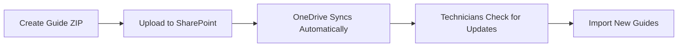

# OneDrive Guide Updates System

## Problem Statement

**IT Restriction**: SharePoint REST API and Microsoft Graph API access is blocked.

**Requirements**:
- Automatic guide updates for field technicians
- No manual file copying
- Works within IT restrictions
- Reliable and simple

## Solution: OneDrive Sync Folder Monitoring

Instead of using SharePoint APIs, we leverage **OneDrive's built-in sync capability** with local file system access.

### How It Works

```
1. IT Admin (SharePoint)
   └─> Uploads guide ZIPs to: SharePoint/GuideViewer_Guides/Guides/

2. OneDrive Sync (Automatic)
   └─> Syncs folder to: C:\Users\[User]\OneDrive - Glory Global\GuideViewer_Guides\

3. GuideViewer App
   └─> Monitors local OneDrive folder
   └─> Detects new/updated guides
   └─> Imports them into local database
```

### Key Advantages

✅ **No API Access Required** - Pure file system operations
✅ **No Admin Rights Needed** - OneDrive syncs to %LocalAppData%
✅ **Automatic Sync** - OneDrive handles cloud synchronization
✅ **Reliable** - No fragile `odopen://` protocol tricks
✅ **Offline-First** - Works with existing architecture
✅ **Simple** - Standard OneDrive for Business

---

## Architecture

### Components

**IOneDriveGuideService** (`GuideViewer.Core/Services/`)
- Detects OneDrive sync folder (registry + environment variables)
- Scans for guide ZIP packages
- Compares with local database
- Imports guides via `IGuideImportService`
- Optional: FileSystemWatcher for real-time monitoring

**SettingsPage UI**
- "Check for Guide Updates" button
- OneDrive connection status display
- InfoBar for results
- Guide selection dialog

**GuideUpdatesDialog**
- Shows available updates (New vs Updated)
- Checkbox selection for each guide
- "Select All" / "Select None" buttons
- Import summary

### OneDrive Folder Detection

The service detects OneDrive folder location using multiple methods:

1. **Registry** (Primary)
   ```
   HKEY_CURRENT_USER\Software\Microsoft\OneDrive\Accounts\Business1\UserFolder
   ```

2. **Environment Variables** (Fallback)
   ```
   %OneDriveCommercial%
   ```

3. **Known Paths** (Final fallback)
   ```
   C:\Users\[User]\OneDrive - Glory Global\GuideViewer_Guides\
   ```

### File Structure

```
SharePoint (Cloud):
└── GuideViewer_Guides/
    └── Guides/
        ├── kitchen_sink_v1.2.zip
        ├── water_heater_v2.0.zip
        └── electrical_panel_v1.5.zip

↓ OneDrive Sync (Automatic)

Local PC:
└── C:\Users\[User]\OneDrive - Glory Global\GuideViewer_Guides\
    └── Guides/
        ├── kitchen_sink_v1.2.zip
        ├── water_heater_v2.0.zip
        └── electrical_panel_v1.5.zip

↓ GuideViewer Import

Local Database:
└── %LocalAppData%\GuideViewer\data.db
    └── guides collection (LiteDB)
```

---

## Setup Instructions

### For IT Admin / SharePoint Administrator

#### 1. Create SharePoint Folder Structure

```powershell
# In SharePoint site: https://gloryglobal.sharepoint.com/sites/Service/NA

1. Create folder: GuideViewer_Guides
2. Create subfolder: GuideViewer_Guides/Guides
3. Set permissions: Read-only for all technicians
```

#### 2. Configure OneDrive Sync

Option A: **Manual (Per PC)**
```
1. Open OneDrive settings
2. Click "Manage backup"
3. Navigate to SharePoint site
4. Select "GuideViewer_Guides" folder
5. Click "Sync"
```

Option B: **Group Policy (Automated)**
```powershell
# Using OneDrive for Business GPO
# Computer Configuration > Policies > Administrative Templates > OneDrive

Enable: "Configure team site libraries to sync automatically"

HKLM\Software\Policies\Microsoft\OneDrive\TenantAutoMount
    - Name: Glory Global
    - Value: https://gloryglobal.sharepoint.com/sites/Service/NA/Shared Documents|GuideViewer_Guides
```

#### 3. Publish Guides

```powershell
# Upload guide ZIP files to SharePoint
# Structure: GuideViewer_Guides/Guides/[guide_name].zip

# Guide ZIP should contain:
# - guide.json (guide metadata + steps)
# - images/[image_files] (if any)
```

### For Field Technicians

#### 1. Initial Setup

1. **Verify OneDrive is Running**
   - Check system tray for OneDrive icon
   - Should show "OneDrive - Glory Global"

2. **Verify Sync Folder Exists**
   - Open File Explorer
   - Navigate to: `%OneDriveCommercial%\GuideViewer_Guides`
   - Should see "Guides" subfolder with ZIP files

3. **Open GuideViewer**
   - Go to **Settings** page
   - Check "OneDrive Guide Sync" section
   - Should show: "Connected to: [path]"

#### 2. Check for Guide Updates

1. Click **"Check for Guide Updates"** button
2. If updates available:
   - Dialog shows list of new/updated guides
   - All guides selected by default
   - Click **"Import Selected"**
3. Wait for import to complete
4. New guides appear in Guides list

---

## Deployment Workflow

### Publishing New Guides (IT Admin)



**Step-by-Step**:

1. **Create Guide Package**
   ```bash
   # Use GuideViewer's export function or create manually
   # Must be valid ZIP with guide.json
   ```

2. **Upload to SharePoint**
   ```
   - Go to SharePoint site
   - Navigate to: GuideViewer_Guides/Guides/
   - Upload ZIP file: [guide_name]_v[version].zip
   ```

3. **Wait for Sync**
   ```
   OneDrive syncs within 1-5 minutes
   ```

4. **Notify Technicians**
   ```
   - Email or Teams message
   - "New guides available - check Settings > Guide Updates"
   ```

### Versioning Strategy

**Recommended naming convention**:
```
[guide_name]_v[major].[minor].zip

Examples:
  kitchen_sink_v1.0.zip
  kitchen_sink_v1.1.zip   (minor update)
  kitchen_sink_v2.0.zip   (major revision)
```

**Update Detection**:
- Service compares `LastModified` date of ZIP file
- If ZIP is newer than local guide's `UpdatedAt`, marks as "Updated"
- If guide ID/title doesn't exist locally, marks as "New"

---

## Implementation Details

### Service Registration

```csharp
// App.xaml.cs - ConfigureServices()
services.AddSingleton<IOneDriveGuideService, OneDriveGuideService>();
```

### Key Methods

**GetOneDriveFolderPath()**
```csharp
// Detects OneDrive sync folder location
// Returns: C:\Users\[User]\OneDrive - Glory Global\GuideViewer_Guides
// Returns null if not found
```

**IsOneDriveFolderAvailable()**
```csharp
// Checks if folder exists and contains "Guides" subfolder
// Returns: true/false
```

**CheckForGuideUpdatesAsync()**
```csharp
// Scans OneDrive folder for ZIP files
// Compares with local database
// Returns: List<GuideUpdateInfo> with New/Updated flags
```

**ImportGuideFromOneDriveAsync()**
```csharp
// Reads ZIP file into memory
// Calls IGuideImportService to import into database
// Returns: ImportResult (success/failure)
```

### Optional: Real-Time Monitoring

```csharp
// Start monitoring on app startup (MainWindow or App.xaml.cs)
var oneDriveService = App.GetService<IOneDriveGuideService>();
oneDriveService.GuideUpdatesDetected += OnGuideUpdatesDetected;
oneDriveService.StartMonitoring();

// Shows notification when new guides detected
private async void OnGuideUpdatesDetected(object sender, GuideUpdateDetectedEventArgs e)
{
    // Show InfoBar or TeachingTip: "3 new guides available!"
}
```

---

## Comparison with SharePoint API Approach

| Feature | OneDrive Sync | SharePoint API |
|---------|---------------|----------------|
| **IT Approval** | ✅ Not needed | ❌ Blocked |
| **Setup Complexity** | ✅ Simple | ❌ Complex |
| **Authentication** | ✅ Handled by OneDrive | ❌ OAuth/App Registration |
| **Offline Support** | ✅ Yes (files are local) | ❌ No |
| **Real-time Detection** | ✅ FileSystemWatcher | ❌ Polling required |
| **Bandwidth** | ✅ OneDrive optimizes | ❌ Full downloads |
| **Reliability** | ✅ High | ⚠️ Depends on API availability |

---

## Troubleshooting

### "OneDrive guide folder not found"

**Check**:
1. Is OneDrive running? (Check system tray)
2. Is OneDrive signed in to business account?
3. Is "GuideViewer_Guides" folder synced?

**Fix**:
```
1. Open OneDrive settings
2. Go to "Manage backup"
3. Navigate to SharePoint site
4. Select "GuideViewer_Guides"
5. Click "Sync"
```

### "OneDrive folder found but not accessible"

**Check**:
- Folder permissions on local file system
- OneDrive sync errors (right-click OneDrive icon > View sync problems)

**Fix**:
```
1. Close GuideViewer
2. Open File Explorer
3. Navigate to: %OneDriveCommercial%\GuideViewer_Guides
4. Right-click > Properties > Security
5. Ensure current user has Read permissions
```

### "Import failed: Invalid guide format"

**Check**:
- ZIP file must contain `guide.json`
- JSON must be valid format
- Images (if any) must be in `images/` folder

**Fix**:
```
1. Use GuideViewer's export function to create valid format
2. Or manually create ZIP matching export structure
```

---

## Testing Checklist

### Initial Setup Test

- [ ] OneDrive sync folder detected
- [ ] Settings page shows "Connected to: [path]"
- [ ] "Check for Guide Updates" button enabled

### Update Detection Test

- [ ] Upload new guide ZIP to SharePoint
- [ ] Wait for OneDrive sync (~2 minutes)
- [ ] Click "Check for Guide Updates"
- [ ] Dialog shows new guide with "NEW" badge

### Import Test

- [ ] Select guide in dialog
- [ ] Click "Import Selected"
- [ ] Progress shows during import
- [ ] Success message displayed
- [ ] New guide appears in Guides list

### Version Update Test

- [ ] Export existing guide from GuideViewer
- [ ] Modify guide (change title or add step)
- [ ] Upload modified ZIP with same filename
- [ ] Click "Check for Guide Updates"
- [ ] Dialog shows guide with "UPDATED" badge
- [ ] Import replaces old version

---

## Security Considerations

### Read-Only SharePoint Access

**Recommendation**: Set SharePoint folder permissions to **Read-Only** for technicians

```powershell
# SharePoint > GuideViewer_Guides > Settings > Permissions
- Technicians: Read
- Admins: Contribute/Full Control
```

**Why**: Prevents accidental deletion or modification of published guides

### File Validation

**Built-in checks**:
- ✅ ZIP format validation
- ✅ JSON schema validation
- ✅ Image size limits (10MB)
- ✅ Malware scanning (Windows Defender scans OneDrive files)

---

## Future Enhancements

### Phase 2 (Optional)

1. **Automatic Background Checks**
   - Check for updates every 4 hours
   - Show notification badge on Settings icon

2. **Delta Updates**
   - Only download changed images
   - Reduce bandwidth usage

3. **Scheduled Updates**
   - "Check daily at 7:00 AM"
   - Silent import with notification

4. **Rollback Support**
   - Keep previous version for 7 days
   - "Undo last import" button

---

## Summary

The OneDrive Sync Folder Monitoring approach provides a **simple, reliable, and IT-approved** method for distributing guide updates without requiring SharePoint API access.

**Key Benefits**:
- ✅ Works within IT restrictions
- ✅ No additional infrastructure needed
- ✅ Leverages existing OneDrive for Business
- ✅ Simple for both admins and technicians
- ✅ Maintains offline-first architecture

**Next Steps**:
1. Test OneDrive folder detection on a field PC
2. Upload sample guide ZIP to SharePoint
3. Verify sync and import workflow
4. Train IT admin on publishing process
5. Document for technician onboarding
